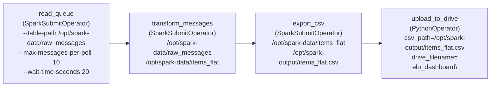

# nelo-test

Pipeline en tres pasos, sobre PySpark, que consume eventos de analítica estilo GA4 e-commerce desde SQS y los deja aplanados en un CSV — con una cuarta tarea opcional que sube ese CSV a una Google Sheet en Drive cuando corre orquestado por Airflow.

Este README se enfoca en tres cosas: el diagrama del proceso ETL, el diagrama del DAG de Airflow, y la definición de la tabla de modelado de datos que queda en `output/items_flat.csv`.

## Diagrama del proceso ETL

```mermaid
flowchart TB
    SQS[("SQS\ndata-engineering-case-analytics-queue")]

    subgraph S1["1. read_queue.py"]
        direction TB
        R1["poll único a SQS\nVisibilityTimeout=120"]
        R2["parseo pseudo-JSON\n(src/pseudo_json.py)"]
        R3["upsert por message_id\n(unionByName + Window + row_number)"]
        R4["delete_message_batch\n(recién después de escribir)"]
        R1 --> R2 --> R3 --> R4
    end

    RAW[("data/raw_messages/\n(Parquet, 1 fila = 1 mensaje)")]

    subgraph S2["2. transform_messages.py"]
        direction TB
        T1["explode de body.items\n(1 fila por item)"]
        T2["id = sha256(message_id + item_id)"]
        T3["pivot de item_params\na columnas dinámicas"]
        T4["join fila base + pivot"]
        T5["upsert por id\n(mismo patrón unionByName + Window)"]
        T1 --> T2 --> T3 --> T4 --> T5
    end

    FLAT[("data/items_flat/\n(Parquet, 1 fila = 1 item, deduplicada)")]

    subgraph S3["3. export_csv.py"]
        direction TB
        E1["lee items_flat/ tal cual\n(sin merge, sin lógica de negocio)"]
        E2["coalesce(1) + escritura atómica\na carpeta temporal, mueve la\núnica parte al nombre final"]
        E1 --> E2
    end

    CSV["output/items_flat.csv\n(volcado completo, se reemplaza\nentero en cada corrida)"]

    subgraph S4["4. dags/upload_to_drive.py — solo orquestado"]
        direction TB
        U1["busca Sheet existente\npor nombre en GOOGLE_DRIVE_FOLDER_ID"]
        U2["files().update(media_body=csv)\nreimporta el CSV como datos de la Sheet"]
        U1 --> U2
    end

    SHEET[["Google Sheet nativa en Drive\n(misma hoja, contenido reemplazado)"]]

    SQS --> S1 --> RAW --> S2 --> FLAT --> S3 --> CSV
    CSV -.->|"solo make stack-up\n(no en make pipeline)"| S4 --> SHEET

    style S4 stroke-dasharray: 5 5
    style SHEET stroke-dasharray: 5 5
```

**Notas clave del flujo:**

- `read_queue.py` es el único paso que toca la cola real: borra los mensajes (`delete_message_batch`) recién *después* de que el upsert en `raw_messages/` ya se escribió con éxito. Si la escritura falla, el mensaje nunca se borra y vuelve a quedar visible a los 120s para reintentarse — el upsert por `message_id` lo deduplica igual si llega dos veces.
- `read_queue.py` y `transform_messages.py` comparten el mismo patrón de upsert (deliberadamente duplicado, no extraído a una función común): `unionByName` con la tabla existente + `Window.partitionBy(clave).orderBy(received_at.desc())` + quedarse con la fila `row_number == 1` + escritura atómica vía `.tmp` y `rename`.
- `export_csv.py` **no hace upsert**: solo vuelca el estado ya deduplicado de `items_flat/` a un único archivo CSV. No necesita saber nada de `message_id`/`id`.
- `upload_to_drive.py` corre en modo orquestado únicamente (`make stack-up`, cuarta tarea del DAG) — `make pipeline` local se detiene en el CSV.

## Diagrama del DAG (`dags/etl_pipeline.py`, orquestado con Airflow + Spark)

- `dag_id="etl_pipeline"`, `schedule=None` (disparo manual vía `make stack-trigger`), `conn_id="spark_default"` resuelve a `spark://spark-master:7077?deploy_mode=client`.
- Las tres primeras tareas son los mismos scripts de `spark/`, sin copias ni adaptación, enviados como jobs al cluster Spark standalone.
- `upload_to_drive` corre como driver de Airflow dentro de `airflow-worker-1` (no es un job de Spark): toma el CSV ya generado y actualiza el contenido de una Google Sheet existente en Drive.
- Los mismos `data/` y `output/` del pipeline local están montados dentro del stack (`/opt/spark-data`, `/opt/spark-output`), así que ambos modos comparten la misma tabla Parquet y el mismo CSV.

## Modelo de datos: `output/items_flat.csv`

Una fila por **item** de evento (un evento sin items produce una única fila con las columnas de item en `null`). La clave primaria es `id`; el archivo se vuelca completo en cada corrida, ya deduplicado por `transform_messages.py`.

### Identificadores y metadata

| Columna | Tipo | Descripción |
|---|---|---|
| `id` | string (sha256 hex) | Clave primaria. `sha256(message_id + "::" + item_id)`, o `sha256(message_id + "::__no_item__")` si el evento no trae item. |
| `message_id` | string | `MessageId` de SQS del mensaje de origen. Varias filas pueden compartir el mismo `message_id` (una por item). |
| `received_at` | string (ISO 8601 UTC) | Timestamp de cuándo `read_queue.py` recibió el mensaje. Se usa como criterio de "más reciente" en los dos upserts del pipeline. |

### Campos del evento (`EVENT_FIELDS`, iguales para todos los items de un mismo mensaje)

| Columna | Tipo | Descripción |
|---|---|---|
| `event_timestamp` | long | Timestamp del evento (epoch, formato GA4). |
| `user_id` | string | Identificador de usuario. |
| `event_name` | string | Nombre del evento (`view_item`, `purchase`, `add_to_cart`, etc.). |
| `platform` | string | Plataforma de origen del evento. |
| `replay_timestamp` | string | Timestamp de replay, cuando aplica. |

### Campos del item (`ITEM_FIELDS`, uno por fila; null si el evento no trae items)

| Columna | Tipo | Descripción |
|---|---|---|
| `item_id` | string | Identificador del producto. |
| `item_name` | string | Nombre del producto. |
| `item_brand` | string | Marca. |
| `item_variant` | string | Variante (talla, color, etc.). |
| `item_category` … `item_category5` | string | Jerarquía de categorías (5 niveles). |
| `price_in_usd` | double | Precio unitario en USD. |
| `price` | double | Precio unitario en moneda local. |
| `quantity` | long | Cantidad. |
| `item_revenue_in_usd` | double | Ingreso del item en USD. |
| `item_revenue` | double | Ingreso del item en moneda local. |
| `item_refund_in_usd` | double | Reembolso del item en USD. |
| `item_refund` | double | Reembolso del item en moneda local. |
| `coupon` | string | Cupón aplicado. |
| `affiliation` | string | Punto de venta / afiliación. |
| `location_id` | string | Ubicación asociada. |
| `item_list_id` / `item_list_name` / `item_list_index` | string | Lista donde apareció el item (búsqueda, categoría, etc.) y su posición. |
| `promotion_id` / `promotion_name` | string | Promoción asociada. |
| `creative_name` / `creative_slot` | string | Creatividad publicitaria asociada. |

### Columnas dinámicas (pivot de `item_params`)

`transform_messages.py` pivotea la lista `item_params` (pares `{key, value}`) en una columna por cada `key` distinta que aparezca en los datos — no es un conjunto fijo, cambia según lo que llegue por SQS. `value` puede venir en cuatro variantes (`string_value`/`int_value`/`float_value`/`double_value`, solo una poblada por fila); todas se homogeneizan a `string` en la columna final.

En la corrida actual, las claves observadas producen estas columnas: `_el`, `discounts`, `discountt`, `error_value`, `firebase_error`, `in_stock`, `installment_price`, `number_of_installments`, `totalPrice`.

> ⚠️ Si una `key` de `item_params` coincide con el nombre de una columna ya existente (por ejemplo `id` o un campo de item), el `join` del pivot puede duplicar o pisar esa columna — no hay guarda para esto porque no se ha visto en los datos reales.
